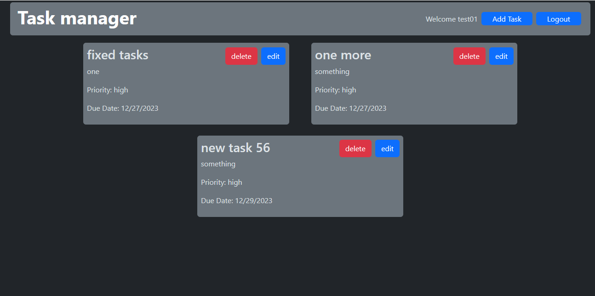

# MERN CRUD App

Aplication using the stack MERN(MongoDB, Express, React, Node)

Features:
- Connection to a MongoDB database.
- Route handling.
- User authentication control
- Task Manager App
- CRUD for tasks.

Live Site:
https://taskmanager-15ow.onrender.com/

Roberto Gauna
